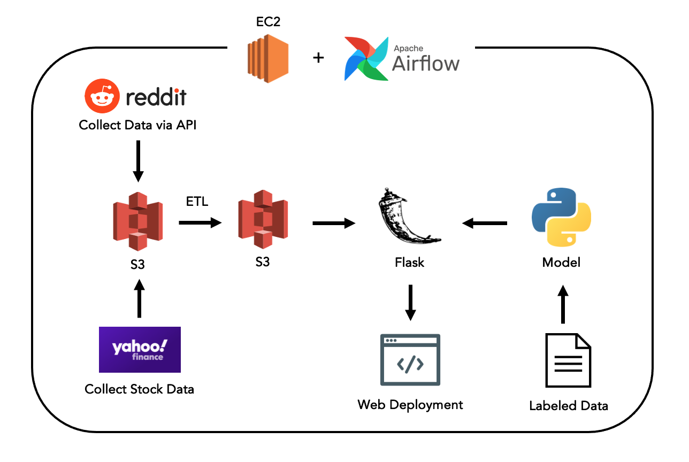

# Stock Movement Prediction & Data Pipeline

## Original dataset:
A Kaggle dataset was used to train an NLP ML classification model. The data used for model trainig came from 2 sources:
1. Headline news: Daily world news headlines were collected from Reddit (top 25 headlines daily)
2. Stock data: closing stock price for the Dow Jones Industrial Average (DJIA) was collected from yahoo finance

Note: the data (training data) was for the time period from 2008-06-08 to 2016-07-01.

This is a binary classification task, with only two labels:
- (1) When DJIA closing value rose or stayed as the same on a specific date (9:30 AM - 4:00 PM) EST
- (2) When DJIA closing value decreased on a specific date (9:30 AM - 4:00 PM) EST

## My contribution:
Besides using the dataset to train a model, my interest in this in this topic motivated me to take things a step futher to create a complete data pipeline and an end-to-end data science project (shown in the diagram below).

A server (EC2 instance) hosted on AWS was used along with Airflow (to schedule and automate workflows), to collect headline news from Reddit, in addition to the DJIA stock closing value daily from yahoo finance. The raw data was stored in an S3 data lake, before applying ETL transformations to prepare the data in the required format.   

Later, Flask was used for the webframework. The collected data from S3 (features/headline news + stock value) was fed to the pickled ML model to predict the stock value for that date.

A basic HTML/CSS website was developed to display the result daily. Link to website can be found here! 

